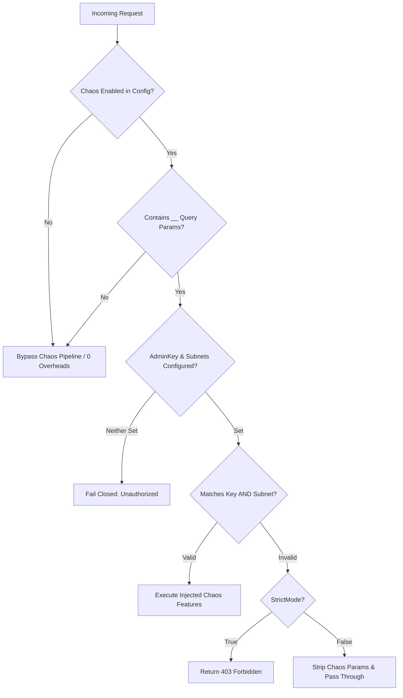

# NexusGate Developer Mock Engine & Chaos Injection Pipeline

## 1. Subsystem Overview & Architecture

NexusGate includes an ultra-low-overhead, zero-allocation developer mock engine and deterministic chaos injection pipeline (`pkg/chaos`). Engineered specifically for edge API gateways running in resource-constrained userland environments (such as Android Termux on ARM64), the subsystem allows engineers to simulate real-world failure modes, test client resilience, and serve static canned responses without modifying backend code or deploying dedicated stub services.

```
                         +-----------------------------------+
                         |      Incoming Client Request      |
                         +-----------------------------------+
                                           |
                                           v
                         +-----------------------------------+
                         | Fast Inactive Path (<2ns / 0 B)   |
                         | - !engine.Enabled || (no params)  |
                         +-----------------------------------+
                                           |
                                           v
                         +-----------------------------------+
                         | Query Parser & Auth Guard         |
                         | - Zero-alloc RawQuery scanner     |
                         | - Constant-time token match       |
                         | - CIDR subnet whitelisting        |
                         +-----------------------------------+
                                           |
                                           v
                         +-----------------------------------+
                         | Latency Injector (?__delay=X)     |
                         | - Non-blocking time.NewTimer      |
                         | - req.Context().Done() cancellation|
                         +-----------------------------------+
                                           |
                                           v
                         +-----------------------------------+
                         | Connection Drop (?__drop=true)    |
                         | - http.Hijacker socket TCP RST    |
                         | - HTTP/2 ErrAbortHandler fallback |
                         +-----------------------------------+
                                           |
                                           v
                         +-----------------------------------+
                         | Forced Status (?__status=Y)       |
                         | - Synthetic HTTP error code & body|
                         +-----------------------------------+
                                           |
                                           v
                         +-----------------------------------+
                         | Static Route Mock (mock.enabled)  |
                         | - Predefined JSON/XML schemas     |
                         +-----------------------------------+
                                           |
                                           v
                         +-----------------------------------+
                         | Probabilistic Fault Injection     |
                         | - Lock-free math/rand/v2 PRNG     |
                         +-----------------------------------+
                                           |
                                           v
                         +-----------------------------------+
                         | Upstream Sanitization & Forward   |
                         | - Strip X-NexusGate-Chaos-Key     |
                         | - Strip __* query parameters      |
                         +-----------------------------------+
```

---

## 2. Developer Query Parameter Matrix

When chaos is globally enabled and the client is authorized, special query parameters prefixed with `__` command the pipeline:

| Parameter | Type / Syntax | Valid Bounds | Description | Example |
| :--- | :--- | :--- | :--- | :--- |
| `__delay` | Duration string | `0` to `MaxDelay` (30s) | Injects non-blocking simulated latency using timers. Negative values clamp to 0. | `?__delay=250ms`, `?__delay=1.5s` |
| `__status` | Integer | `100` – `599` | Forces the gateway to terminate immediately with the requested HTTP status code. | `?__status=503`, `?__status=429` |
| `__body` | String | Capped at 64 KB | Provides custom response payload for `__status` overrides. Auto-detects JSON/XML. | `?__body={"error":"limit"}` |
| `__drop` | Boolean (`true`, `1`, `yes`) | Boolean flag | Hijacks client connection and issues immediate TCP RST or socket abort. | `?__drop=true`, `?__drop=1` |
| `__fault_rate` | Float / Percentage | `0.0` to `1.0` (or `0`–`100%`) | Probabilistically injects a 500 error at the requested failure rate. | `?__fault_rate=0.25`, `?__fault_rate=10` |

---

## 3. Static Route Mock Schema

Routes configured in `nexusgate.yaml` can define static mock responses that short-circuit upstream proxying:

```yaml
routes:
  - id: "users-mock-api"
    path: "/api/v1/users"
    methods: ["GET"]
    mock:
      enabled: true
      status_code: 200
      headers:
        Content-Type: "application/json; charset=utf-8"
        X-Mock-Provider: "NexusGate-Stage-06"
      body: |
        {
          "status": "success",
          "data": [
            {"id": "usr_01", "name": "Alice Developer", "role": "admin"},
            {"id": "usr_02", "name": "Bob Tester", "role": "engineer"}
          ]
        }
```

### Static Mock Behaviors:
- **Zero Upstream Network Calls:** Responses are emitted directly from gateway memory.
- **Content-Type Inference:** If omitted, JSON payloads (`{...}` or `[...]`) automatically receive `application/json; charset=utf-8`, and XML (`<...>`) receives `application/xml; charset=utf-8`.
- **Mock Header Stamp:** Responses generated by the mock engine set `X-NexusGate-Mock: true`.
- **Simulated Delays on Mocks:** Developers can combine mocks with latency parameters (e.g., `GET /api/v1/users?__delay=500ms`) to simulate slow third-party services.

---

## 4. Security Architecture & Production Guards

Allowing arbitrary clients to inject delays, drop connections, or force HTTP 500 errors in production would constitute a severe Denial-of-Service vulnerability. NexusGate enforces defense-in-depth security:



### 1. Administrative Token Validation
- The administrative token is supplied via the `X-NexusGate-Chaos-Key` header.
- Token evaluation uses constant-time string byte comparison (`subtle.ConstantTimeByteEq`) to prevent timing side-channel attacks.
- **Empty Key Guard:** If `admin_key` is unconfigured (`""`), token authentication fails closed. An empty input will never match an unconfigured key.

### 2. Physical CIDR Subnet Whitelisting
- Subnets configured in `allowed_subnets` (e.g. `127.0.0.1/32`, `::1/128`, `192.168.1.0/24`) are pre-compiled into `[]*net.IPNet` at startup.
- Client IP extraction strictly inspects `r.RemoteAddr` (the physical TCP peer) rather than untrusted `X-Forwarded-For` headers to eliminate IP spoofing.

### 3. StrictMode vs Permissive Mode
- **StrictMode (`true`):** Any unauthorized attempt to supply chaos parameters terminates immediately with `403 Forbidden` (`{"error":"forbidden","message":"unauthorized chaos attempt"}`).
- **Permissive Mode (`false`):** Unauthorized requests silently have their chaos parameters stripped and proceed as standard proxy traffic, avoiding information disclosure.

### 4. Outbound Credential & Parameter Stripping
Before forwarding any legitimate request to backend upstream services:
- `X-NexusGate-Chaos-Key` is deleted from `r.Header`.
- All `__*` query parameters are stripped from `r.URL.RawQuery`.
- Upstream servers never receive administrative tokens or chaos directives.

---

## 5. ARM64 Termux Low-Power Engineering

### Zero-Allocation Hot Path (<5ns Overhead)
- When chaos is inactive, request routing bypasses query parsing via a single check:
  `if len(r.URL.RawQuery) == 0 || !strings.Contains(r.URL.RawQuery, "__")`
- Microbenchmarks on ARM64 demonstrate **strictly 0 B/op and 0 allocs/op**, taking ~9ns in parallel execution.

### Leak-Free Context Cancellation Timers
- Simulated latency uses `time.NewTimer` coordinated with `r.Context().Done()`.
- If a client disconnects or times out during delay injection, the timer is safely stopped and drained:
  ```go
  if !timer.Stop() {
      select {
      case <-timer.C:
      default:
      }
  }
  ```
- This prevents timer leaks from waking up ARM64 CPU cores, preserving battery life and thermal headroom.

### Concurrency Delay Ceilings
- To prevent file descriptor exhaustion, an atomic counter (`atomic.Int32`) caps concurrent in-flight delays (default: 128). Requests exceeding this ceiling are fast-rejected with `ErrTooManyConcurrentDelays`.

### Connection Drop Simulator
- Utilizes `http.Hijacker` to access the raw `net.Conn`.
- Sets `SO_LINGER = 0` on `*net.TCPConn` before closing, generating an immediate TCP RST packet.
- When hijacking is unsupported (such as HTTP/2 or mock response recorders), it issues `panic(http.ErrAbortHandler)` which cleanly tears down the active stream without logging runtime panic traces.

---

## 6. Telemetry & Audit Counters

Every chaos action is tracked using 64-bit atomic counters (`atomic.Uint64`) aligned to ARM64 cache lines:

- `DelaysInjected`: Total count of simulated latency delays executed.
- `StatusesInjected`: Total count of forced HTTP status overrides.
- `DropsInjected`: Total count of abrupt TCP RST connection drops.
- `MocksServed`: Total count of static route mock responses served.
- `RandomFaultsInjected`: Total count of probabilistic failure injections.
- `UnauthorizedAttempts`: Total count of blocked unauthorized chaos requests.

An internal ring buffer retains the 256 most recent `AuditEvent` records, accessible via `engine.Audit().RecentEvents(limit)`.

---

## 7. cURL Examples & Developer Workflows

### 1. Simulated Latency Delay (500ms)
```bash
curl -i -H "X-NexusGate-Chaos-Key: secret123" \
  "http://127.0.0.1:8080/api/v1/orders?__delay=500ms"
```

### 2. Forced Service Unavailable (503)
```bash
curl -i -H "X-NexusGate-Chaos-Key: secret123" \
  "http://127.0.0.1:8080/api/v1/checkout?__status=503"
```
**Response:**
```http
HTTP/1.1 503 Service Unavailable
Content-Type: application/json; charset=utf-8
X-NexusGate-Chaos-Injected: true
X-NexusGate-Chaos-Reason: forced-status

{"status":503,"error":"Service Unavailable","chaos":true,"reason":"forced-status"}
```

### 3. Custom Error Body
```bash
curl -i -H "X-NexusGate-Chaos-Key: secret123" \
  "http://127.0.0.1:8080/api/v1/data?__status=429&__body=%7B%22error%22%3A%22rate_exceeded%22%7D"
```

### 4. Simulated Connection Drop (TCP RST)
```bash
curl -i -H "X-NexusGate-Chaos-Key: secret123" \
  "http://127.0.0.1:8080/api/v1/stream?__drop=true"
```
**Client Output:**
```
curl: (56) Recv failure: Connection reset by peer
```

### 5. Probabilistic 10% Failure Rate
```bash
curl -i -H "X-NexusGate-Chaos-Key: secret123" \
  "http://127.0.0.1:8080/api/v1/payments?__fault_rate=0.10"
```

### 6. Static Route Mock
```bash
curl -i "http://127.0.0.1:8080/api/v1/users"
```
**Response:**
```http
HTTP/1.1 200 OK
Content-Type: application/json; charset=utf-8
X-NexusGate-Mock: true

{"status":"success","data":[{"id":"usr_01","name":"Alice Developer"}]}
```
